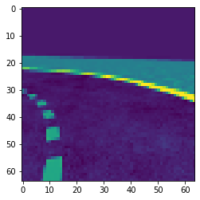

<h1>AWS Deepracer Challenge Playground</h1>

<h2>Description of the repo</h2>
The code present on this repo bootstraps on the Starter Kit given by the AIcrowd team for the AWS Deepracer Challenge.

Most of the custom code is present in the deepracer-gym folder, where the notebooks and util functions resides.

The idea during this project was to try out many different RL algorithms and feature extractions methods to create the fastest running agent in the simulation tracks. Some attempts at this involve using otsu thresholding to differentiate the road boundaries and center, disparity maps for future object detection, and using stable_baselines3 RL library with different feature extraction models to try out different RL algortihms for our agent.

<h2>Showcase of some experiments</h2>

<h3>Observations used during training</h3>
The Image-related features we had the most success with were adding otsu thresholding with 3 classes, to segment the image in three parts : the road, the sidelines, and the middle dotted line.

<table>
  <tr>
    <th>Left Image</th>
    <th>Right Image</th>
    <th>Left Otsu Thresholding</th>
    <th>Right Otsu Thresholding</th>
  </tr>
  <tr>
    <td></td>
    <td></td>
    <td></td>
    <td></td>
  </tr>
</table>

<h3>Experiments</h3>
Because the challenge supposedly had object detection in mind, we wanted to add Disparity Images to our observations, but they were never added so we didn't further continue using them.

We tried out using Gradcam to verify if our model was using the right part of the images to determine which action to take, but we were not always convinced of the result.
<table>
    <tr>
        <th>Gradcam</th>
        <th>Disparity</th>
    </tr>
    <tr>
        <td></td>
        <td></td>
    </tr>
</table>

<h3>Example of car running</h3>
This is not a representation of our best running model, but a previous instalment.
The number represents which action is taken (from 0 to 4, leaning the most left to the most right).

